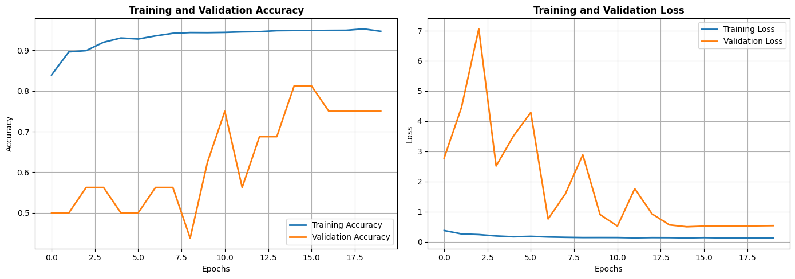

# Chest X-Ray Pneumonia Classification (CNN)

A convolutional neural network that classifies paediatric chest X-rays
(anterior–posterior view) as **NORMAL** or **PNEUMONIA**.

## Problem Statement

The dataset comprises 5,863 JPEG chest X-ray images from paediatric
patients aged one to five years, organised into `train`, `val`, and
`test` folders, each with a `NORMAL` and a `PNEUMONIA` subfolder. The
task is to build a CNN that classifies a chest X-ray image into one of
these two categories, accurately enough to be useful as a clinical
decision-support tool.

| Split | Images | Classes |
|---|---|---|
| Train | 5,216 | NORMAL, PNEUMONIA |
| Validation | 16 | NORMAL, PNEUMONIA |
| Test | 624 | NORMAL, PNEUMONIA |

The training set is imbalanced — PNEUMONIA outnumbers NORMAL roughly
3:1 — and the official validation split is very small (16 images),
which matters for how the results should be read (see **Findings**
below).

## Files

```
.
├── cnn_assignment.py   # full pipeline: data loading, training, evaluation, plots
├── README.md            # this file
└── training_validation_accuracy.png   # accuracy/loss curves (see below)
```

## Approach & Methodology

Two models were built and trained, in order:

**1. Baseline CNN** — 3 convolutional blocks (32 → 64 → 128 filters,
3×3 kernels, ReLU + MaxPooling), followed by a Flatten, a 128-unit
dense layer, Dropout (0.5), and a sigmoid output. Trained for 15
epochs with `ImageDataGenerator` augmentation (rotation, shift, zoom,
horizontal flip) and the Adam optimizer, no class weighting.

**2. Improved CNN (final model)** — a deeper 4-block architecture
(32 → 64 → 128 → 256 filters) with **BatchNormalization** after every
convolution and the dense layer, stronger augmentation (shear added,
larger rotation/zoom/shift ranges), and:
- **Class weights** computed with `sklearn.utils.class_weight.compute_class_weight("balanced", ...)` to correct for the NORMAL/PNEUMONIA imbalance in training.
- **ReduceLROnPlateau** (factor 0.3, patience 2) to lower the learning rate when validation loss stalls.
- **EarlyStopping** (patience 5, `restore_best_weights=True`) to stop training once validation loss stopped improving and roll back to the best epoch.

Trained for up to 25 epochs; early stopping triggered at epoch 20 and
restored the weights from **epoch 15**, the best-performing checkpoint.
This is the model that was evaluated and saved (`chest_xray_cnn_model.keras`).

Both models share the same evaluation pipeline: accuracy/loss curves,
a confusion matrix, a full `classification_report` (precision/recall/F1
per class), and an ROC curve on the held-out test set.

## Results

| Model | Test Accuracy | Test AUC |
|---|---|---|
| Baseline CNN (no class weights, 15 epochs) | 80.45% | 0.9422 |
| **Improved CNN (final, class-weighted, 25 epochs / early-stopped)** | **91.19%** | **0.9695** |

**Classification report — final model, test set (624 images):**

| Class | Precision | Recall | F1-score | Support |
|---|---|---|---|---|
| NORMAL | 0.88 | 0.88 | 0.88 | 234 |
| PNEUMONIA | 0.93 | 0.93 | 0.93 | 390 |
| **Accuracy** | | | **0.91** | 624 |
| Macro avg | 0.91 | 0.91 | 0.91 | 624 |
| Weighted avg | 0.91 | 0.91 | 0.91 | 624 |

Adding class weighting alone lifted PNEUMONIA/NORMAL recall to a much
more balanced 0.93/0.88 — in the baseline model, the 3:1 class
imbalance was pulling recall down specifically on the minority
(NORMAL) class.

### Training and Validation Curves



*(Generated by `cnn_assignment.py` — training accuracy/loss on the left
pair of axes, validation on the right; see Findings for how to read
the validation curve.)*

## Findings

- **Class weighting materially helped.** Test accuracy went from
  80.45% → 91.19% and AUC from 0.9422 → 0.9695 once class weights,
  BatchNorm, and a deeper architecture were introduced together —
  most notably, recall stopped being skewed toward the majority
  (PNEUMONIA) class.
- **The validation curve is noisy, not necessarily unstable.** The
  official `val/` split only has 16 images, so each validation batch
  is a handful of examples — one or two misclassifications swing
  validation accuracy by 6–12 points and validation loss by whole
  integers (visible in the chart above: validation accuracy jumps from
  ~0.44 up to ~0.94 while training accuracy climbs smoothly to ~0.95).
  This is a property of the tiny validation set, not evidence that the
  model itself is unstable — the 624-image **test set** result (91.19%
  accuracy) is the more trustworthy estimate of real-world performance.
- **Training accuracy (~95%) is noticeably higher than test accuracy
  (91.19%)**, a mild overfitting gap consistent with a fairly deep
  network trained on ~5,200 images. Dropout (0.5) and augmentation are
  already mitigating this; more aggressive regularization or more
  training data would likely narrow the gap further.
- **Error profile.** Precision on PNEUMONIA (0.93) is higher than
  recall on NORMAL (0.88), meaning the model is somewhat more likely
  to mistake a NORMAL X-ray for PNEUMONIA than the reverse — the safer
  direction to err in for a screening tool, since a missed pneumonia
  case is more costly than a false alarm that a radiologist can rule out.

## Conclusion

A CNN can classify these paediatric chest X-rays with strong accuracy
(91.19%) and a high AUC (0.9695), and the largest single improvement
came not from a deeper network alone but from explicitly correcting
for class imbalance via computed class weights, combined with
BatchNorm and learning-rate/early-stopping callbacks to stabilize
training. For a production or clinical-support setting, the next steps
would be: a larger, more representative validation split (16 images is
too small to tune on reliably), threshold tuning to further favor
PNEUMONIA recall if false negatives are the priority to minimize, and
a Grad-CAM-style saliency check so predictions can be visually
audited against the actual X-ray findings before being trusted.
